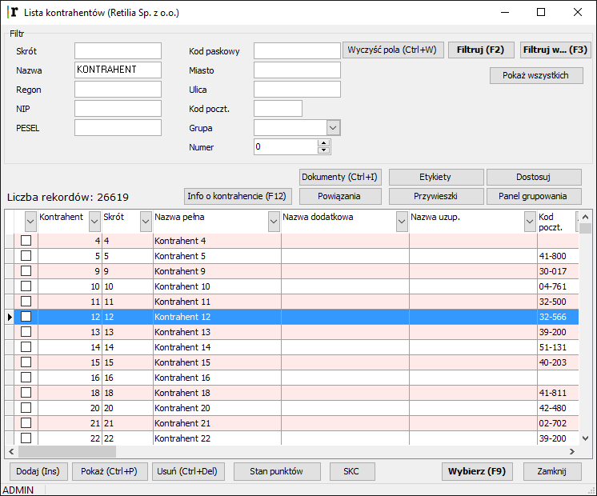
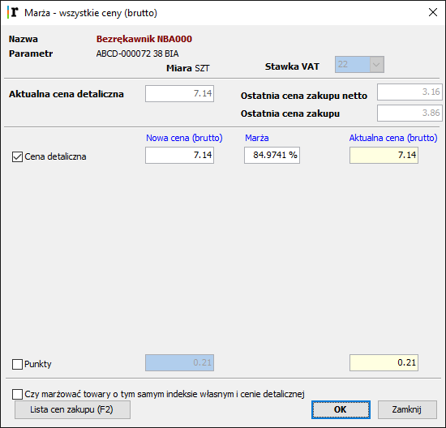
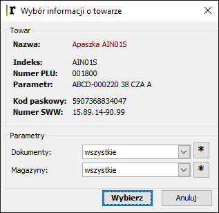
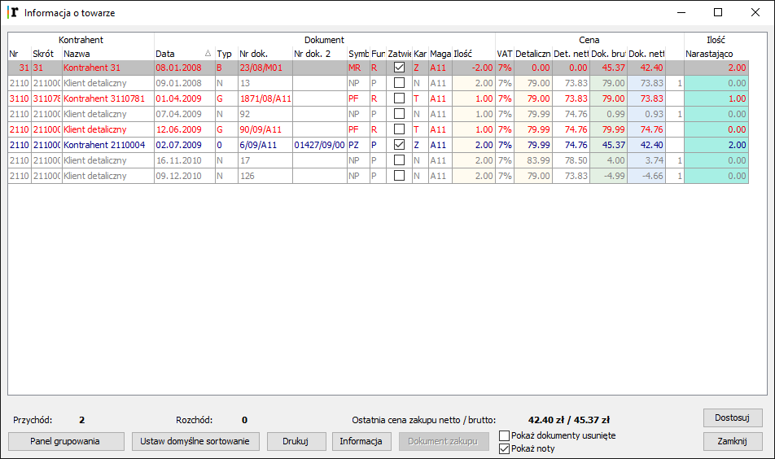
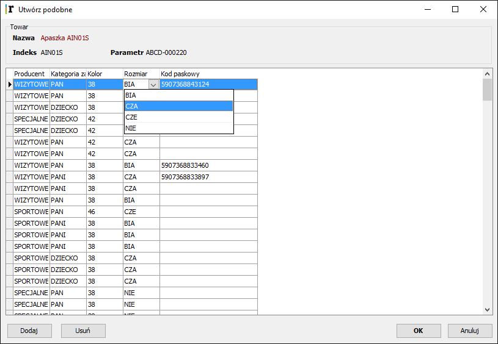

6. Dokumenty magazynowe
=========================

6.1 Dokument MM
------------------

**Dokument MM (Przesunięcie między magazynami) jest dowodem magazynowego przesunięcia towaru np. z centrali do sklepu.**

Dokumenty MM mogą być wprowadzane do systemu pojedynczo przez operatora systemu lub w automatycznej procedurze importu dokumentów. Tutaj opisany jest ręczny sposób wprowadzania danych.

Niezbędne informacje, które powinny zostać zapisane do systemu podczas wprowadzania dokumentu MM to:

**W nagłówku:**

- rodzaj / symbol dokumentu 
- data 
- numer dokumentu 
- kontrahent 
- magazyn wydający 
- magazyn przyjmujący

**W treści – pozycji towarowej:**

- nazwa towaru i jego symbol oraz ew. inne oznakowania 
- ilość

.. |txt1| replace:: Na dokumencie MM cena towaru jest przekazywana automatycznie i operator jej nie wprowadza. 	 

.. |zdj1| image:: _zdj/6.1mm.png
   :scale: 50%
   :align: middle
   :target: _zdj/6.1mm.png

+----------+---------+
|  |txt1|  |  |zdj1| |
+----------+---------+

**Nagłówek**

.. |txt2| replace:: **Rodzaj / symbol dokumentu**
.. |txt201| replace:: Jeżeli procedura zapisu dokumentu MM wywoływana jest bezpośrednio z menu programu, wtedy ten rodzaj uzupełnia się automatycznie i wyświetla w oknie do wprowadzania w polu **Rodzaj**.
.. |txt202| replace:: Jeżeli natomiast procedura zapisu dokumentu jest wywoływana poprzez klawisz **Dodaj** z Listy dokumentów, wtedy należy wybrać z listy znajdującej się pod strzałką pola **Rodzaj** odpowiedni dokument, czyli *”MM Przesunięcie towaru między magazynami”*.	 

.. |zdj2| image:: _zdj/6.1mm.png
   :scale: 50%
   :align: middle
   :target: _zdj/6.1mm.png
   
.. |txt3| replace:: **Data** wstawia się automatycznie bieżąca, chcąc ją zmienić można wpisać inną datę lub wyświetlić strzałką obok kalendarz i wybrać odpowiednią datę.

.. |txt4| replace:: **Numer dokumentu** pobiera się automatycznie z bazy danych jako kolejny. Można go w razie potrzeby zmienić na inny. 

.. |txt5| replace:: **Kontrahent** – obok pola Kontrahent znajdują sie dwa klawisze: **Lista** i Domyślny**.
.. |txt501| replace:: Klawisz **Lista** wywołuje listę kontrahentów, z której trzeba wybrać właściwego. Wybór kontrahenta ułatwi filtrowanie wg zadanego parametru. Można wpisać skrót dla danego kontrahenta lub część nazwy lub NIP, albo miasto, ulicę lub grupę kontrahentów. W zestawie parametrów może być jeden lub kilka. Po wpisaniu parametru/ów/ trzeba kliknąć klawisz **Filtruj** lub **Filtruj w...** . **Filtruj w...** przeszukuje całą zawartość odpowiedniego pola w bazie kontrahentów i szuka ciągu podanych znaków, a klawisz **Filtruj** bierze pod uwagę pierwsze znaki odpowiedniego pola i porównuje z podanym parametrem. Program wyszuka i wyświetli wszystkich kontrahentów, których dane spełniają zadane kryteria.

   
.. |txt6| replace:: Klawisz **Pokaż wszystkie** – jego kliknięcie spowoduje, że program pobierze wszystkich kontrahentów i wyświetli ich na ekranie.
.. |txt601| replace:: Jeśli nie ma jeszcze tego kontrahenta w bazie danych to można go dodać wywołując procedurę zapisu nowego kontrahenta klawiszem **Dodaj** na Liście kontrahentów. 
.. |txt602| replace:: Po wskazaniu kontrahenta na liście należy kliknąć klawisz **Wybierz** i dane zostaną przeniesione na dokument. Klawisz **Domyślny** pozwala przywrócić kontrahenta, który przypisany jest do dokumentów MM jako domyślny w definicji dokumentu. 

.. |zdj6| image:: _zdj/6.1mm2.png
   :scale: 50%
   :align: middle
   :target: _zdj/6.1mm2.png

.. |txt7| replace:: **Magazyn** dla dokumentu MM może być określony na stałe w definicji dokumentu, może być też kilka magazynów przyjmujących. Jeśli jest określony jeden, wtedy w oknie dokumentu wyświetla się on automatycznie, w przeciwnym razie operator musi wskazać właściwy magazyn wybierając go z listy magazynów (pod strzałką obok pola **Magazyn**) lub wpisując odpowiedni symbol.
 
.. |zdj7| image:: _zdj/6.1magazyn.png
   :scale: 50%
   :align: middle
   :target: _zdj/6.1magazyn.png
 
+----------+---------+
|  |txt2|  |  |zdj2| |
|  |txt201||         |
|  |txt202||         |
+----------+---------+
|  |txt3|  |         |
+----------+---------+
|  |txt4|  |         |
+----------+---------+
|  |txt5|  |  |zdj5| |
|          |         |
|  |txt501||         |
+----------+---------+
|  |txt6|  |  |zdj6| |
|          |         |
|  |txt601||         |
|          |         |
|  |txt602||         |
+----------+---------+
|  |txt7|  |  |zdj7| |
+----------+---------+

Dopiero po uzupełnieniu powyższych danych aktywnym staje się klawisz Dodaj, który umożliwia dopisanie pozycji do dokumentu oraz pole Kod i obok klawisz Lista, którym uruchamia się okno z listą towarów. Natomiast po wprowadzeniu pierwszej pozycji aktywnymi stają sie pozostałe klawisze na dole okna służące do edycji dokumentu.

**Treść – pozycja towarowa**

.. |txt8| replace:: Dodanie pozycji towarowej do dokumentu może odbywać się na kilka sposobów, poprzez: 
.. |txt801| replace:: wczytanie kodu kreskowego towaru w polu **Kod**
.. |txt802| replace:: wprowadzenie kodu PLU w polu **Kod**
.. |txt803| replace:: poprzez klawisz **Lista** lub **Dodaj** i wybór towaru z *Listy towarów*. Na liście towarów można wskazać od razu wiele pozycji towarowych i kliknąć klawisz **Wybierz**.

.. |zdj8| image:: _zdj/6.1ltow1.png
   :scale: 50%
   :align: middle
   :target: _zdj/6.1ltow1.png

.. |txt804| replace:: Na Liście towarów można podać parametry towarów do wyświetlenia (np.: grupa towarowa lub część nazwy lub kod kreskowy albo parametr) i użyć klawisza **Filtruj**. Wyświetlą się wybrane towary. 

Podwójnym klikiem na pozycji lub klawiszem spacji z klawiatury zaznaczamy towary do przeniesienia na dokument. Po zaznaczeniu wybranych towarów klikamy klawisz **Wybierz** i przechodzimy do następnego etapu zapisu dokumentu – do wprowadzenia ilości w oknie **Towar**. 	 

+----------+---------+
||txt8|    |  |zdj8| |
|          |         |
|- |txt801||         |
|- |txt802||         |
|- |txt803||         |
|          |         |
||txt804|  |         |
+----------+---------+

W oknie dokumentu MM można także zmieniać jego zawartość. 
**Służą do tego klawisze edycji:**

- Marża      
- Zmień cenę
- Popraw 
- Usuń
- Opis

**Oprócz tych są jeszcze klawisze:**

- Drukuj
- Szablon
- Dostosuj

.. |txt9| replace:: **Marża** – tym klawiszem uruchamia się funkcję zmiany ceny sprzedaży towaru. W oknie *Marża –> Cena detaliczna* należy podać nową cenę sprzedaży towaru. 

.. |txt10| replace:: **Popraw** – służy do poprawienia ilości towaru.

.. |zdj10| image:: _zdj/6.1towar.png
   :scale: 50%
   :align: middle
   :target: _zdj/6.1towar.png
   
.. |txt11| replace:: **Usuń** - pozwala usunąć wskazaną pozycję z dokumentu. Operacje należy przedtem potwierdzić.

.. |zdj11| image:: _zdj/6.1potwierdzenie.png
   :scale: 50%
   :align: middle
   :target: _zdj/6.1potwierdzenie.png
   
.. |txt12| replace:: **Opis** – pozwala dodać komentarz do dokumentu, który zostanie zachowany w bazie.	 

.. |zdj12| image:: _zdj/6.1opis.png
   :scale: 50%
   :align: middle
   :target: _zdj/6.1opis.png
   
.. |txt13| replace:: **OK** – po zatwierdzeniu dokumentu następuje procedura drukowania.

.. |zdj13| image:: _zdj/6.1mmwydruk.png
   :scale: 50%
   :align: middle
   :target: _zdj/6.1mmwydruk.png
   
.. |txt14| replace:: Wyświetla sie okno z szablonami wydruków do wyboru. Można uzyskać wydruk dokumentu w cenach zakupu lub cenach sprzedaży (po zmarżowaniu). Należy wybrać odpowiedni szablon i polecenie *Drukuj*. Następnie w pełnym oknie ukaże się postać dokumentu do wydruku. Klikając na ikonę drukarki na górnym pasku uzyskamy wydruk na drukarce. Wydruk można również zapisać w innych formatach i wyeksportować do pliku lub przeglądać w innym programie. W tym celu należy nacisnąć ikonę kopert na górnym pasku ekranu i wskazać odpowiedni format zapisu oraz przeznaczenie.	 

.. |zdj14| image:: _zdj/6.1export.png
   :scale: 50%
   :align: middle
   :target: _zdj/6.1export.png
   
.. |txt15| replace:: **Szablon** – tym klawiszem wywołuje się funkcję obsługi szablonów. Szablon jest pewnym schematycznym dokumentem zapamiętanym pod unikalną nazwą. Można zapamiętać szablon dokumentu MM od określonego dostawcy, który dostarcza zawsze podobny zestaw towarów. Przy kolejnej dostawie można przywołać szablon zamiast wybierać towary z listy, a następnie zmienić ilości i ceny zakupu w oknie Parametry dodania.	 

.. |txt16| replace:: Aby zapisać nowy szablon, należy pod koniec edycji dokumentu MM, który uznamy za standardowy dla danego dostawcy, kliknąć klawisz Szablon. Wtedy wyświetli się okno Szablon i pod klawiszem Dodaj wpisujemy nazwę, pod którą chcemy zapamiętać dany dokument.

.. |txt17| replace:: Aby skorzystać z zapamiętanego wcześniej szablonu, należy podczas edycji dokumentu kliknąć klawisz Szablon i Wybierz na wskazanym szablonie. Program pobierze pozycje towarowe z szablonu i można je zaktualizować w polach cena i ilość, zbędne wykasować, lub dopisać nowe.

.. |txt18| replace:: **Dostosuj widok** – ten klawisz służy do dodawania lub usuwania kolumn widocznych w tabeli z towarami, a także do ustawiania kolorów dla poszczególnych elementów okna. Szczegółowy opis działania tej funkcji opisany jest w oddzielnej sekcji pt: *”Dostosuj widok”*.
.. |txt181| replace:: Po uruchomieniu klawisza pojawia się okno *Dostosuj widok*. Na pierwszej zakładce pt. *Kolumny* - z lewej strony okna jest wykaz kolumn, które można jeszcze dodać do tabeli, a z prawej wykaz kolumn, które są aktualnie wyświetlane. Używając klawiszy **Dodaj** i **Usuń**, można odpowiednio ustawić zawartość kolumn. Klawiszami strzałek w dolnej części okna można natomiast ustawić ich kolejność.	

.. |txt19| replace:: W zakładce *Kolory* można ustawić kolory tła i tekstu dla wierszy parzystych i nieparzystych, dla nagłówków oraz tło dla tabeli z pozycjami towarowymi.

+----------+---------+
|  |txt9|  |  |zdj9| |
+----------+---------+
|  |txt10| |  |zdj10||
+----------+---------+
|  |txt11| |  |zdj11||
+----------+---------+
|  |txt12| |  |zdj12||
+----------+---------+
|  |txt13| |  |zdj13||
+----------+---------+
|  |txt14| |  |zdj14||
+----------+---------+
|  |txt16| |         |
+----------+---------+
|  |txt17| |         |
+----------+---------+
|  |txt18| |         |
|  |txt181||         |
+----------+---------+
|  |txt19| |         |
+----------+---------+

6.2 Dokument PZ
-----------------
**Dokument PZ (Przyjęcie z Zewnątrz) jest dowodem przyjęcia towaru z zakupu do magazynu (sklepu).**
Dokumenty PZ mogą być wprowadzane do systemu pojedynczo przez operatora systemu lub w automatycznej procedurze importu dokumentów. 
Niezbędne informacje, które powinny zostać zapisane do systemu podczas wprowadzania dokumentu PZ to:

**W nagłówku:**
		
- rodzaj / symbol dokumentu 
- data
- numer dokumentu 
- kontrahent 
- magazyn przyjmujący

**W treści – pozycji towarowej:**
		
- nazwa towaru i jego symbol 
- ilość przyjęta
- cena zakupu towaru (netto i brutto)
- stawka VAT 
- cena sprzedaży towaru (netto i brutto)

.. |txt20| replace:: W zależności od definicji dokumentu PZ mogą być jeszcze wprowadzane inne dodatkowe informacje, jednak te wydają się być zasadnicze dla tego dokumentu.	 

.. |zdj20| image:: _zdj/6.2pz1.png
   :scale: 50%
   :align: middle
   :target: _zdj/6.2pz1.png

+----------+---------+
|  |txt20| |  |zdj20||
+----------+---------+

**Nagłówek**
		
.. |txt21| replace:: **Rodzaj / symbol dokumentu**  - jeżeli procedura zapisu dokumentu PZ wywoływana jest bezpośrednio z menu programu, wtedy ten rodzaj uzupełnia się automatycznie i wyświetla w oknie do wprowadzania w polu **Rodzaj**. Jeżeli natomiast procedura zapisu dokumentu jest wywoływana poprzez klawisz **Dodaj** z *Listy dokumentów*, wtedy należy wybrać z listy znajdującej się pod strzałką pola **Rodzaj** odpowiedni dokument, czyli *”0 PZ Przychód zewnętrzny”*.	 

.. |zdj21| image:: _zdj/6.2ldokpz.png
   :scale: 50%
   :align: middle
   :target: _zdj/6.2ldokpz.png
   
.. |txt22| replace:: **Data** wstawia się automatycznie bieżąca, chcąc ją zmienić można wpisać inną datę lub wyświetlić strzałką obok kalendarz i wybrać odpowiednią datę. 	 

.. |zdj22| image:: _zdj/6.2ldokpzkal.png
   :scale: 50%
   :align: middle
   :target: _zdj/6.2ldokpzkal.png
   
.. |txt23| replace:: **Numer dokumentu** pobiera się automatycznie z bazy danych jako kolejny. Można go w razie potrzeby zmienić na inny.

.. |txt24| replace:: **Kontrahent** – obok pola Kontrahent znajdują się dwa klawisze: **Lista** i **Domyślny**. Klawisz **Lista** wywołuje listę kontrahentów, z której trzeba wybrać właściwego. Wybór kontrahenta ułatwi filtrowanie wg zadanego parametru. Można wpisać skrót dla danego kontrahenta lub część nazwy lub NIP, albo miasto, ulicę lub grupę kontrahentów. W zestawie parametrów może być jeden lub kilka. Po wpisaniu parametru/ów/ trzeba kliknąć klawisz **Filtruj** lub **Filtruj w...** . **Filtruj w...** przeszukuje całą zawartość odpowiedniego pola w bazie kontrahentów i szuka ciągu podanych znaków, a klawisz **Filtruj** bierze pod uwagę pierwsze znaki odpowiedniego pola i porównuje z podanym parametrem.

   
.. |txt241| replace:: Program wyszuka i wyświetli wszystkich kontrahentów, których dane spełniają zadane kryteria. Klawisz **Pokaż wszystkie** – jego kliknięcie spowoduje, że program pobierze wszystkich kontrahentów i wyświetli ich na ekranie Jeśli nie ma jeszcze tego kontrahenta w bazie danych to można go dodać wywołując procedurę zapisu nowego kontrahenta klawiszem **Dodaj** na *Liście kontrahentów*. Po wskazaniu kontrahenta na liście należy kliknąć klawisz **Wybierz** i dane zostaną przeniesione na dokument. Klawisz **Domyślny** przywraca kontrahenta, który przypisany jest do dokumentów PZ jako domyślny w definicji dokumentu.	 

.. |txt25| replace:: **Magazyn** właściwy dla dokumentu PZ może być określony na stałe w definicji dokumentu, może być też kilka magazynów. Jeśli jest określony jeden, wtedy w oknie dokumentu wyświetla się on automatycznie, w przeciwnym razie operator musi wskazać właściwy magazyn wybierając go z listy magazynów (pod strzałką obok pola **Magazyn**) lub wpisując odpowiedni symbol.	 

.. |zdj25| image:: _zdj/6.2pzmag.png
   :scale: 50%
   :align: middle
   :target: _zdj/6.2pzmag.png

+----------+---------+
|  |txt21| |  |zdj21||
+----------+---------+
|  |txt22| |  |zdj22||
+----------+---------+
|  |txt23| |         |
+----------+---------+
|  |txt24| |  |zdj24||
|  |txt241||         |
+----------+---------+
|  |txt25| |  |zdj25||
+----------+---------+
   
Dopiero po uzupełnieniu powyższych danych aktywnym staje się klawisz **Dodaj**, który umożliwia dopisanie pozycji do dokumentu oraz pole **Kod** i obok klawisz **Lista**, którym uruchamia sie okno z lista towarów. Natomiast po wprowadzeniu pierwszej pozycji aktywnymi stają się pozostałe klawisze na dole okna służące do edycji dokumentu.

**Pozycje towarowe**
		
Wprowadzając pozycje towarowe na dokument PZ należy oprócz identyfikatorów towaru i jego ilości wprowadzić właściwą cenę zakupu oraz stawkę podatku VAT.
 
Ceny występują w wartości netto i brutto. Różnicę między nimi stanowi wartość podatku VAT (cena netto + podatek VAT = cena brutto). Wartość podatku jest obliczana jako cena netto * VAT%. Te przeliczenia odbywają się w programie automatycznie, wystarczy podać jedną z cen oraz właściwą stawkę podatku, a druga cena zostanie wyliczona. Przyjmując towar do magazynu należy także zadbać o wprowadzenie jego właściwej ceny sprzedaży. Jeśli wprowadzany towar istnieje już w bazie danych jako identyczny, ma zapewne swoja cenę sprzedaży, ale może też być potrzeba zmiany tej ceny. Przyjmując towar z zakupu może sie okazać, że w bazie danych on nie występuje i należy go dopisać. Wszystkie te operacje są możliwe do wykonania w trakcie wprowadzania dokumentu PZ. 

**Dodanie pozycji towarowej** do dokumentu może odbywać się na kilka sposobów:

- wczytanie kodu kreskowego towaru w polu **Kod**
- wprowadzenie kodu PLU w polu **Kod**
- poprzez klawisz **Lista** lub **Dodaj** i wybór towaru z Listy towarów.

.. |txt26| replace:: Na Liście towarów można podać parametry towarów do wyświetlenia (np. grupa towarowa, kod kreskowy, parametr) i użyć klawisza Filtruj. Wyświetlą się wybrane towary. Podwójnym klikiem na pozycji zaznaczamy towary do przeniesienia na dokument. Jeśli na liście znajdują się wszystkie towary, których szukamy i nie trzeba zmieniać ich cen detalicznych, wtedy klikamy klawisz Wybierz i przechodzimy do etapu zapisu pozycji, gdzie podamy ilość i cenę zakupu dla każdego wskazanego towaru. 	 

.. |zdj26| image:: _zdj/6.2ltow.png
   :scale: 50%
   :align: middle
   :target: _zdj/6.2ltow.png

+----------+---------+
|  |txt26| |  |zdj26||
+----------+---------+

Zatrzymajmy się jeszcze przy *Liście towarów*, ponieważ może być taka sytuacja, że trzeba będzie:

- uzyskać **informacje o towarze** z Listy w celu porównania
- zmienić **cenę sprzedaży** towaru
- **dodać** do Listy **podobny towar** w innym rozmiarze lub kolorystyce itp.
- **dodać** do Listy **nowy towar** 

**Poniżej opis tych procedur:**

.. |txt27| replace:: **Informacje o towarze**. Na dole Listy dokumentów jest klawisz o tej nazwie. Po kliknięciu klawisza ukazują się szczegółowo informacje identyfikujące towar. W tym oknie pod klawiszem **Wybierz** wyświetlają się kolejne informacje o towarze.

   
.. |txt28| replace:: Obroty na towarze oraz cena sprzedaży w kolumnie *”Cena detaliczna”*.

   
.. |txt29| replace:: **Zmiana ceny sprzedaży towaru**. Na dole Listy dokumentów jest klawisz o nazwie **Marża**. Tym klawiszem uruchamiamy okno, w którym można zmienić cenę sprzedaży w polu **Nowa cena**.

.. |zdj29| image:: _zdj/6.2marza.png
   :scale: 50%
   :align: middle
   :target: _zdj/6.2marza.png
   
.. |txt30| replace:: **Dodać podobny towar**. Klikając na klawisz **Utwórz podobne** wyświetli się okno dopisywania towaru o takiej samej nazwie jak wskazany na *Liście*, który może różnić się rozmiarem, czy kolorem itp. Należy kliknąć **Dodaj** – podświetli się nowy wiersz, w tym wierszu w odpowiedniej kolumnie kliknąć strzałkę i wyświetli się okienko z listą np. rozmiarów do wyboru. Trzeba wybrać odpowiednią charakterystykę i zatwierdzić dopisanie nowego towaru klawiszem **OK**.	 

   
.. |txt31| replace:: **Dodać nowy towar**. Klikając klawisz **Dodaj** uruchamia się okno dopisywania nowego towaru do Listy towarów. 

.. |zdj31| image:: _zdj/6.2danetowaru1.png
   :scale: 50%
   :align: middle
   :target: _zdj/6.2danetowaru1.png
   
.. |txt32| replace:: Po wybraniu z listy jednego lub wielu towarów wyświetla się okno *Parametry dodania* z tymi towarami. Należy uzupełnić wiersze w kolumnie *Ilość* i w kolumnie *Cena*. Jest to cena zakupu netto. Można ewentualnie zmienić pole w kolumnie VAT, jeśli stawka VAT uległa zmianie.

.. |zdj32| image:: _zdj/6.2paramdod.png
   :scale: 50%
   :align: middle
   :target: _zdj/6.2paramdod.png
   
.. |txt33| replace:: Po zaakceptowaniu towarów klawiszem **OK**, zostają one zapisane na tworzonym dokumencie PZ.

.. |zdj33| image:: _zdj/6.2pz3.png
   :scale: 50%
   :align: middle
   :target: _zdj/6.2pz3.png
   
.. |txt34| replace:: W oknie dokumentu PZ można także zmieniać jego zawartość. Służą do tego klawisze edycji:
.. |txt341| replace:: Marża
.. |txt342| replace:: Popraw 
.. |txt343| replace:: Usuń
.. |txt344| replace:: Opis
.. |txt345| replace:: Drukuj
.. |txt346| replace:: Usuń 
.. |txt347| replace:: Dostosuj

.. |txt35| replace:: **Marża** – tym klawiszem uruchamia się funkcję identyczną z opisaną wyżej w punkcie **Zmiana ceny sprzedaży towaru**. 

.. |txt36| replace:: **Popraw** – służy do poprawienia pozycji towarowej: ilości, a także ewentualnie ceny lub stawki procentowej VAT.

.. |zdj36| image:: _zdj/6.2popraw.png
   :scale: 50%
   :align: middle
   :target: _zdj/6.2popraw.png
   
.. |txt37| replace:: **Usuń** – pozwala usunąć wskazaną pozycję z dokumentu. Operacje należy przedtem potwierdzić. 

.. |txt38| replace:: **Opis** – pozwala dodać komentarz do dokumentu, który zostanie zachowany w bazie.	 

.. |zdj38| image:: _zdj/6.2opis.png
   :scale: 50%
   :align: middle
   :target: _zdj/6.2opis.png
   
.. |txt39| replace:: **OK** – po zatwierdzeniu dokumentu następuje procedura drukowania. Wyświetla sie okno z szablonami wydruków do wyboru. Można uzyskać wydruk dokumentu w cenach zakupu lub po nazwie. Należy wybrać odpowiedni szablon i polecenie **Drukuj**.

.. |zdj39| image:: _zdj/6.2wydruki.png
   :scale: 50%
   :align: middle
   :target: _zdj/6.2wydruki.png
   
.. |txt40| replace:: Następnie w pełnym oknie ukaże się postać dokumentu do wydruku. Klikając na ikonę drukarki na górnym pasku uzyskamy wydruk na drukarce.

.. |zdj40| image:: _zdj/6.2pzwydruk.png
   :scale: 50%
   :align: middle
   :target: _zdj/6.2pzwydruk.png
   
.. |txt41| replace:: Wydruk można również zapisać w innych formatach i wyeksportować do pliku lub przeglądać w innym programie. W tym celu należy nacisnąć ikonę kopert na górnym pasku ekranu i wskazać odpowiedni format zapisu oraz przeznaczenie.

.. |zdj41| image:: _zdj/6.2export.png
   :scale: 50%
   :align: middle
   :target: _zdj/6.2export.png
   
.. |txt42| replace:: **Dostosuj widok** – ten klawisz służy do dodawania lub usuwania kolumn widocznych w tabeli z towarami, a także do ustawiania kolorów dla poszczególnych elementów okna. Szczegółowy opis działania tej funkcji opisany jest w oddzielnej sekcji pt: *“Dostosuj widok”*.
.. |txt421| replace:: Po uruchomieniu klawisza pojawia się okno *Dostosuj widok*. Na pierwszej zakładce pt. *Kolumny* – z lewej strony okna jest wykaz kolumn, które można jeszcze dodać do tabeli, a z prawej wykaz kolumn, które są aktualnie wyświetlane. Używając klawiszy **Dodaj** i **Usuń**, można odpowiednio ustawić zawartość kolumn. Klawiszami strzałek w dolnej części okna można natomiast ustawić ich kolejność.

.. |zdj42| image:: _zdj/6.2dostosuj.png
   :scale: 50%
   :align: middle
   :target: _zdj/6.2dostosuj.png
   
.. |txt43| replace:: W zakładce *Kolory* można ustawić kolory tła i tekstu dla wierszy parzystych i nieparzystych, dla nagłówków oraz tło dla tabeli z pozycjami towarowymi.	 

.. |zdj43| image:: _zdj/6.2dostkolor.png
   :scale: 50%
   :align: middle
   :target: _zdj/6.2dostkolor.png
 
+----------+---------+
|  |txt27| |  |zdj27||
+----------+---------+
|  |txt28| |  |zdj28||
+----------+---------+
|  |txt29| |  |zdj29||
+----------+---------+
|  |txt30| |  |zdj30||
+----------+---------+
|  |txt31| |  |zdj31||
+----------+---------+
|  |txt32| |  |zdj32||
+----------+---------+
|  |txt33| |  |zdj33||
+----------+---------+
||txt34|   |-|txt341||
|          |         |
|          |-|txt342||
|          |         |
|          |-|txt343||
|          |         |
|          |-|txt344||
|          |         |
|          |-|txt345||
|          |         |
|          |-|txt346||
|          |         |
|          |-|txt347||
+----------+---------+
|  |txt35| |         |
+----------+---------+
|  |txt36| |  |zdj36||
+----------+---------+
|  |txt37| |         |
+----------+---------+
|  |txt38| |  |zdj38||
+----------+---------+
|  |txt39| |  |zdj39||
+----------+---------+
|  |txt40| |  |zdj40||
+----------+---------+
|  |txt41| |  |zdj41||
+----------+---------+
|  |txt42| |  |zdj42||
|  |txt421||         |
+----------+---------+
|  |txt43| |  |zdj43||
+----------+---------+