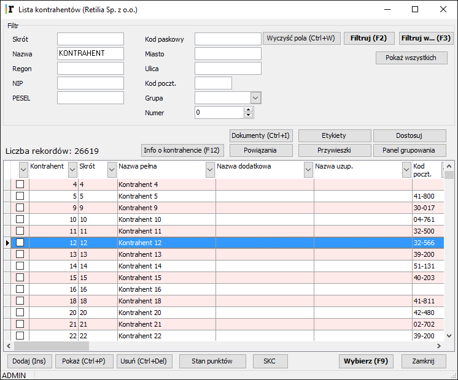

8.Graficzna prezentacja danych
=================================

8.1 Panel grupowania
-----------------------

**Panel grupowania – to funkcja grupowania danych wg zadanych kryteriów. Funkcja ta jest dostępna w wielu oknach systemu Retilia.Point, między innymi na liście kontrahentów, na liście towarów oraz na liście dokumentów.**

.. |txt1| replace:: Dla zilustrowania zasad posługiwania się panelem grupowania, jako przykład wybraliśmy *Listę kontrahentów*.  

   
.. |txt2| replace:: Po wciśnięciu **Panel grupowania**, nad tabelą z kontrahentami ukazał się wydzielony pasek z komentarzem: *„Przeciągnij tutaj nagłówek kolumny, według której ma nastąpić pogrupowanie.”*

   
.. |txt201| replace:: Aby pogrupować kontrahentów wg przykładowych dwóch kryteriów: miejscowości i ulicy, należy przeciągnąć myszką nagłówek kolumny *Miasto* i umieścić w polu szarego paska, a następnie zrobić to samo z nagłówkiem kolumny *Ulica*. Kontrahenci zostaną pogrupowani wg miejscowości, a w ramach miejscowości, wg ulic. 	 

.. |txt3| replace:: W oknie panelu grupowania, po lewej stronie każdego wiersza znajduje się znak ”+” służący do rozwijania wiersza. Klikając na ten znak w każdym kolejnym wierszu system wyświetli informacje o poszczególnych kontrahentach. Informacje te zostaną pogrupowane i wyświetlone wg zadanych wcześniej kryteriów. Panel grupowania służy ułatwieniu wyszukiwania konkretnych pozycji w bazach systemu Retilia.Point. Nie zmienia jednak danych w systemie – służy jedynie ich prezentacji. Aby zwinąć daną grupę wierszy klikamy na znak “-”, który występuje zamiennie ze znakiem “+”.	 

   
.. |txt4| replace:: Jeśli dane są już pogrupowane, wtedy wyszukiwanie danych jest już znacznie ułatwione: klikając na znak strzałki w prawym rogu nagłówka którejkolwiek kolumny system wyświetli okienko z wszystkimi występującymi w danej kolumnie danymi. Obok mamy podgląd na miasto, a także na NIP.	 

+---------+---------+
|  |txt1| |  |zdj1| |   
+---------+---------+
| |txt2|  |  |zdj2| |
| |txt201||         |
+---------+---------+
|  |txt3| |  |zdj3| |   
+---------+---------+
|  |txt4| |  |zdj4| |   
+---------+---------+

8.2 Dostosuj widok
--------------------

**Użytkownik może wybrać informacje, które będą wyświetlane w niektórych oknach w programie oraz ich kolorystykę.**

.. |txt5| replace:: Ta funkcja jest uruchamiana klawiszem **Dostosuj widok**, który znajduje się np. w oknie **Paragon Fiskalny**, w oknie służącym do zapisu dokumentów *Dokument*, w oknie **Lista dokumentów**, **Lista towarów** czy **Lista kontrahentów** .

.. |zdj5| image:: _zdj/8.2pf.png
   :scale: 50%
   :align: middle
   :target: _zdj/8.2pf.png
   
.. |txt6| replace:: Funkcja służy aranżacji kolumn i kolorów w tabelce wyświetlającej towary, czyli pozycje paragonu sprzedaży i pozostałych dokumentów, w trakcie zapisu dokumentu lub jego modyfikacji.
.. |txt601| replace:: Obok jest okno zapisu paragonu sprzedaży z określonymi kolumnami i kolorami. Poniżej pokazane są parametry ustawione funkcją *Dostosuj widok* dla tego okna. 
.. |txt602| replace:: Na pierwszej zakładce pt. **Kolumny** - z lewej strony okna jest wykaz kolumn, które można jeszcze dodać do tabeli w oknie edycji dokumentu, a z prawej wykaz kolumn, które są aktualnie wyświetlane w tabeli. Używając klawiszy **Dodaj** i **Usuń**, można odpowiednio ustawić zawartość kolumn. Klawiszami strzałek w dolnej części okna można natomiast ustawić ich kolejność.
.. |txt603| replace:: W oknie edycji paragonu można ograniczyć liczbę kolumn do niezbędnych dla operatora. Wydaje się, że informacje o cenie netto i wartości netto sprzedaży nie muszą być widoczne w trakcie sprzedaży, więc można je wykluczyć z tabeli, albo ustawić na dalszym miejscu, by były niewidoczne.
.. |txt604| replace:: Podobnie można zrobić z rabatami, jeśli nie są udzielane, dzięki ograniczeniu kolumn można wydłużyć długość wyświetlanej nazwy towaru, jeśli jest taka potrzeba.	 

.. |zdj6| image:: _zdj/8.2pfdost.png
   :scale: 50%
   :align: middle
   :target: _zdj/8.2pfdost.png
   
.. |txt7| replace:: Na zakładce pt. **Kolory** można ustawić kolory dla poszczególnych elementów okna. Można ustawić kolory tła i tekstu dla wierszy parzystych i nieparzystych, dla nagłówków kolumn i kolor tła tabeli z pozycjami dokumentu. W sekcji **Wiersze** można ustawić kolor tła i kolor tekstu inny dla pozycji parzystych i inny dla nieparzystych, wtedy wiersze staną się bardziej czytelne. W sekcji **Nagłówek** ustawia się kolor tła dla nagłówka tabeli i kolor tekstu w nagłówku kolumny tabeli. Można też wybrać wygląd systemowy, wtedy program przywróci kolory standardowe nagłówka.	 

.. |zdj7| image:: _zdj/8.2dostkolor.png
   :scale: 50%
   :align: middle
   :target: _zdj/8.2dostkolor.png
   
.. |txt8| replace:: Na zakładce **Kolory – panel szybka sprzedaż** ustawia się kolorystykę okna zapisu paragonu w trybie szybka sprzedaż.	 

.. |zdj8| image:: _zdj/8.2dostkolor2.png
   :scale: 50%
   :align: middle
   :target: _zdj/8.2dostkolor2.png
   
.. |txt9| replace:: Obok przedstawione są parametry zapisane na zakładce i efekt ich działania w panelu *szybka sprzedaż*.

.. |zdj9| image:: _zdj/8.2sprz.png
   :scale: 50%
   :align: middle
   :target: _zdj/8.2sprz.png

+---------+---------+
|  |txt5| |  |zdj5| |   
+---------+---------+
| |txt6|  |  |zdj6| |
|         |         |
| |txt601||         |
|         |         |
| |txt602||         |
|         |         |
| |txt603||         |
|         |         |
| |txt604||         |
+---------+---------+
|  |txt7| |  |zdj7| |   
+---------+---------+
|  |txt8| |  |zdj8| |   
+---------+---------+
|  |txt9| |  |zdj9| |   
+---------+---------+
   
W sekcji **Kolory tła panelu** należy podać dwa graniczne kolory, gdzie stopniowo pierwszy będzie przechodził w drugi. 
Następnie należy ustawić kolor dla wyświetlanych elementów.
Wskaźnik Tło przezroczyste decyduje, czy ilość i wartość ogółem dokumentu będą wyświetlane na wskazanym tle (kolory: *Ilość sztuk i Wartość dok.*), czy też na tle całego panelu.
Podobnie wskaźnik *Pokaż ramkę* decyduje, czy te pola będą obramowane kreską. Jako tło panelu *szybka sprzedaż* może być użyty obraz, a ścieżkę dostępu do niego określa się w pliku firma.ini. 
Jeśli zastosuje się obrazek jako tło, wtedy ustawienia kolorów tła panelu w tym miejscu nie będą brane pod uwagę.
