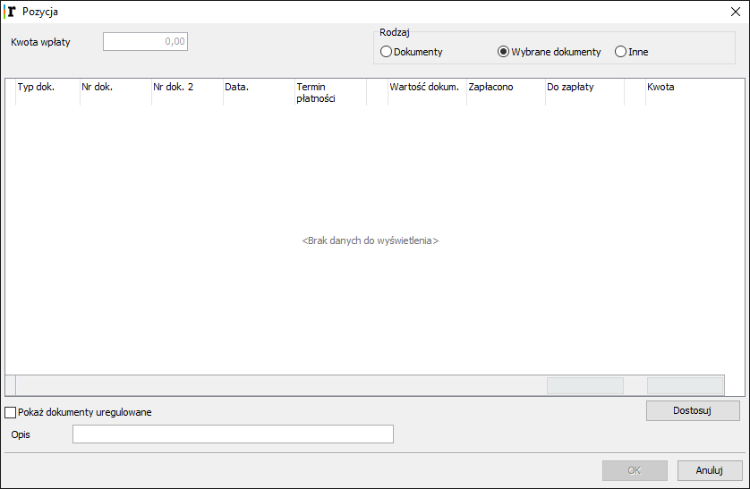

5. Kasa Główna
================

5.1  Obsługa kasy głównej
---------------------------

**W systemie funkcjonują dwa rodzaje kas, gdzie dokonuje się operacji pieniężnych i rozliczeń finansowych z bankiem, klientami i kontrahentami.**

Jednym miejscem jest kasa sklepowa lub kilka takich kas, gdzie wystawia się paragony sprzedaży i przyjmuje płatności od klientów, a drugim miejscem jest kasa główna sklepu, gdzie wpływa utarg ze sprzedaży po raporcie fiskalnym, rozlicza się utarg w poszczególnych formach płatności, a także dokonuje innych operacji kasowych oraz rozliczeń finansowych.

Mogą to być wpłaty do banku, zapłaty za faktury dla kontrahentów, wypłaty dla pracowników itd. W kasie głównej operacji dokonuje sie poprzez dokumenty kasowe.

Dokumenty kasowe i ich obieg definiowane są w systemie w sekcji Konfiguracja systemu –> Obieg dokumentów.

.. |txt1| replace:: Typowymi dokumentami kasowymi są:
.. |txt101| replace:: **KW/Kasa Przyjęła**
.. |txt102| replace:: **KP/Kasa Wydała**
.. |txt103| replace:: **KY/Kasa wydała** (rozliczenie pogotowia kasowego)
.. |txt104| replace:: **KX/Kasa przyjęła** (rozliczenie pogotowia kasowego)
.. |txt105| replace:: **UD/Utarg ze sprzedaży**
.. |txt106| replace:: **RK/Rozliczenie utargu/Karty płatnicze**
.. |txt107| replace:: **RB/Rozliczenie utargu/Bony gotówkowe**
.. |txt108| replace:: **WB/Wpłata do banku itp**.	 

.. |zdj1| image:: _zdj/5.1ldokkas.png
   :scale: 50%
   :align: middle
   :target: _zdj/5.1ldokkas.png

+----------+---------+
||txt1|    |  |zdj1| |
|          |         |
|- |txt101||         |
|- |txt102||         |
|- |txt103||         |
|- |txt104||         |
|- |txt105||         |
|- |txt106||         |
|- |txt107||         |
|- |txt108||         |
+----------+---------+
   
Podobnie można powołać dokumenty rozliczające utarg ze sprzedaży ratalnej i innych form płatności. Dokumenty związane z **rozliczeniem sprzedaży** powstają automatycznie podczas drukowania raportu fiskalnego. Są to: utarg ze sprzedaży (UD) oraz wszystkie dokumenty rozliczające utarg z innymi formami płatności niż gotówka.
Obsługa kasy głównej polega na wystawianiu kwitów i drukowaniu raportów kasowych. Można także **rozliczać płatności** z kontrahentami dla zdefiniowanych odpowiednio dokumentów, np. faktur, PZ itd. Dokumenty kasowe, ich wystawianie i przeglądanie odbywa się w funkcji uruchamianej w zakładce **Kasa główna –> Kasa główna – operacje**. Raporty kasowe wykonuje się w tej samej zakładce funkcją **Raporty**.

5.2 Wystawianie kwitów kasowych
---------------------------------

.. |txt2| replace:: Po uruchomieniu funkcji Kasa główna – operacje, wyświetli się Lista dokumentów kasowych. Podając odpowiednie daty lub kontrahenta można wyświetlić dokumenty z żądanego zakresu.	 

.. |zdj2| image:: _zdj/5.2ldokkaslista.png
   :scale: 50%
   :align: middle
   :target: _zdj/5.2ldokkaslista.png
   
.. |txt3| replace:: Na liście znajdują się klawisze służące do edycji kwitów kasowych. Są to:
.. |txt301| replace:: **Dodaj** – dopisywanie kwitu
.. |txt302| replace:: **Popraw** – zmiana istniejącego kwitu
.. |txt303| replace:: **Usuń** – skasowanie kwitu
.. |txt304| replace:: **Drukuj** – powtórny wydruk kwitu

.. |txt4| replace:: Po wybraniu klawisza **Dodaj** wyświetli się okno **Kasa** – do zapisu dokumentu. Każdy dokument przypisany jest do jakiegoś raportu. Nowe dokumenty zapisują się do bieżącego raportu.
.. |txt401| replace:: Należy wybrać odpowiedni rodzaj kwitu i kontrahenta, a następnie wcisnąć klawisz **Dodaj**. Otworzy się okienko **Pozycja** do wprowadzenia kwoty operacji i opisu.	 

.. |zdj4| image:: _zdj/5.2pozycja.png
   :scale: 50%
   :align: middle
   :target: _zdj/5.2pozycja.png
   
+----------+---------+
|  |txt2|  |  |zdj2| |
+----------+---------+
|  |txt3|  |-|txt301||
|          |         |
|          |-|txt302||
|          |         |
|          |-|txt304||
+----------+---------+
|- |txt4|  |  |zdj4| |
|- |txt401||         |
+----------+---------+

5.3 Rozliczanie płatności
---------------------------

W kasie można również regulować zobowiązania finansowe poprzez płatności gotówkowe. W oknie Kasa wybieramy odpowiedniego kontrahenta i rodzaj kwitu, klikamy klawisz **Dodaj**.

.. |txt5| replace:: W okienku **Pozycja** zaznaczamy opcję **Wybrane dokumenty** lub opcję **Dokumenty**. Wtedy okienko rozwinie się i wyświetli dokumenty oczekujące na zapłatę.

+----------+---------+
|  |txt5|  |  |zdj5| |
+----------+---------+

W opcji **Wybrane dokumenty** mamy możliwość wybrania dokumentu do zapłaty, a w opcji **Dokumenty** brane są pod uwagę wszystkie dokumenty danego kontrahenta do zapłaty. Jako wartość operacji wprowadzamy sumę zobowiązań ze wszystkich wyświetlonych dokumentów danego kontrahenta. Kwota zapłaty może być niższa od wartości wskazanego dokumentu, wtedy po wystawieniu kwitu wartość dokumentu do zapłaty zmniejszy się o wartości już zapłacone. Po wprowadzeniu kwoty należy zatwierdzić dokument klawiszem **OK**. Po zapisaniu kwitu kasowego do systemu opłacone dokumenty zostaną oznaczone jako zapłacone.
