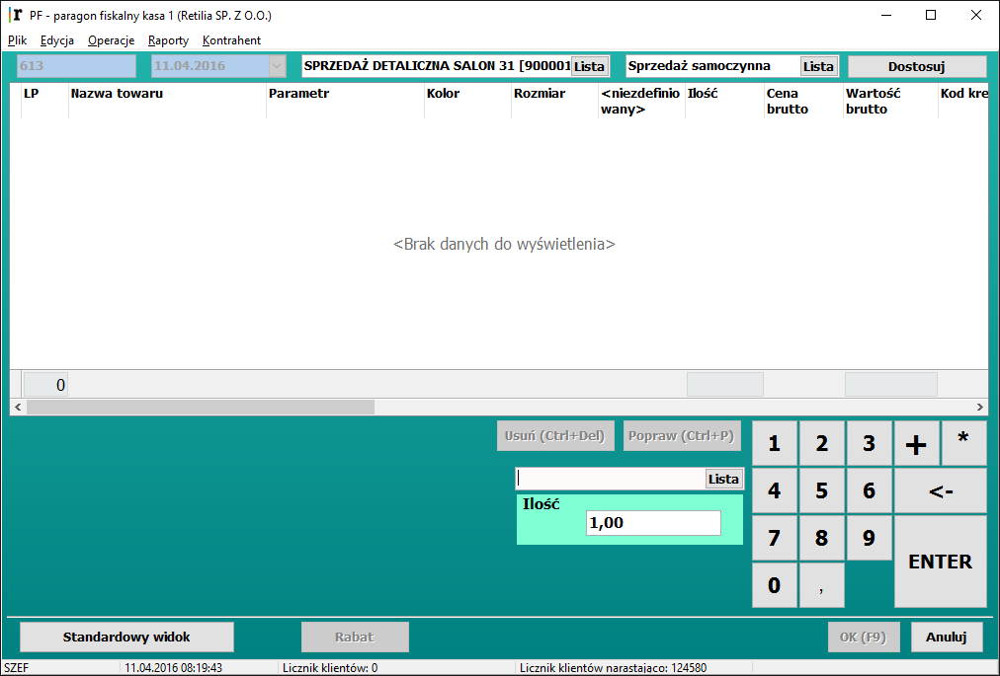
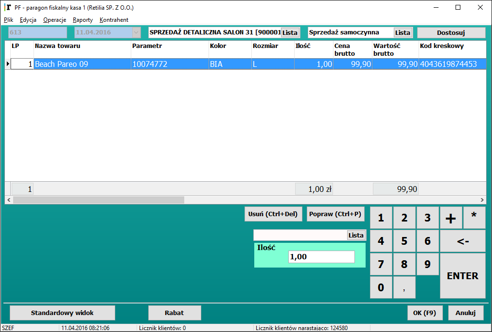
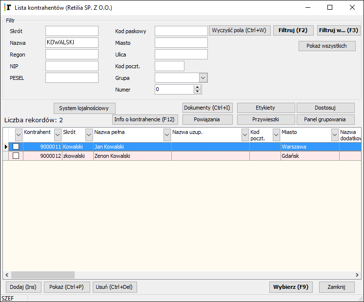
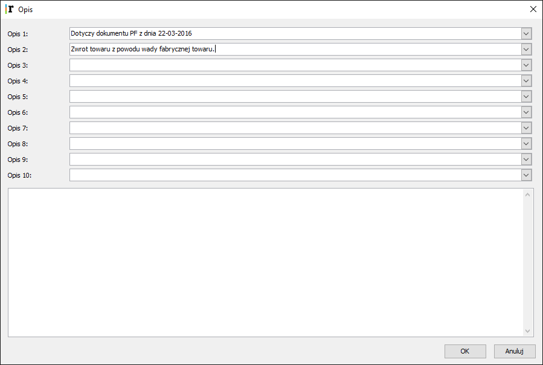
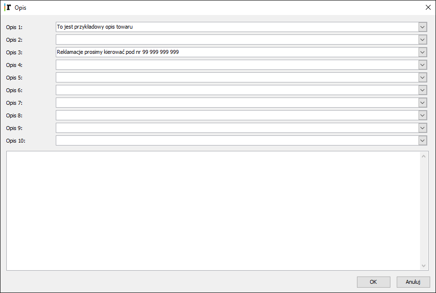
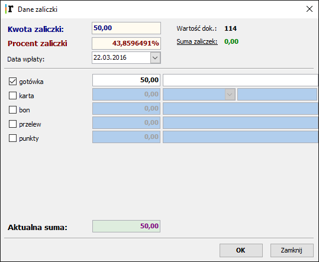
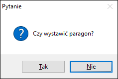
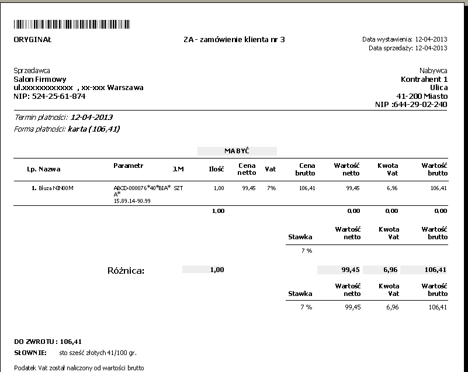
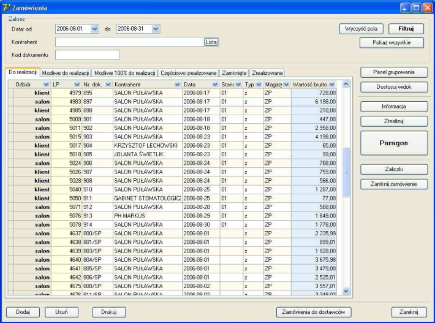

4. Sprzedaż
==============

4.1 Kasa sklepowa
-------------------

**W tej części instrukcji opisany jest sposób prowadzenia sprzedaży na systemie  Retilia.Point, od momenty rozpoczęcia dnia sprzedaży do zakończenia dnia wraz z  omówieniem wystawianych przez kasę sklepową dokumentów.**

.. |txt1| replace:: Operacje – to zestaw czynności związanych z rozpoczęciem i zakończeniem zmiany na stanowisku sprzedaży. Te czynności wiążą się zwykle z wpłatą początkową i wypłatą gotówki na koniec zmiany. W trakcie pracy możliwy jest podgląd wartości utargu. Jest także rejestracja wpłat i wypłat nie związanych z bieżącymi transakcjami sprzedaży.	 

.. |zdj1| image:: _zdj/4.1operacje.png
   :scale: 50%
   :align: middle
   :target: _zdj/4.1operacje.png

.. |txt2| replace:: Są to następujące czynności:
	
.. |txt201| replace:: **Otwórz szufladę (F4)**
.. |txt202| replace:: **Rozpoczęcie zmiany**
.. |txt203| replace:: **Wpłata**
.. |txt204| replace:: **Wypłata**
.. |txt205| replace:: **Zakończenie zmiany**
.. |txt206| replace:: **Podgląd szuflady (F5)**

.. |txt3| replace:: **Otwórz szufladę** - powoduje otwarcie szuflady z gotówką. Standardowo szuflada otwiera się automatycznie po zatwierdzeniu paragonu. Otwarcie szuflady wywołuje też klawisz F4 przy aktywnym oknie paragon.
	
.. |txt4| replace:: **Rozpoczęcie zmiany** – wywołanie tej funkcji wiąże się z wpłatą początkową do kasy sklepowej. Ukazuje się wtedy okienko Rozpoczęcie zmiany. Można w oknie wpłaty podać wartość 0. Wartość należy zatwierdzić klawiszem Enter, a następnie OK. Program nie pozwoli na rozpoczęcie zmiany, jeśli poprzednia zmiana nie została zakończona. Zmianę można rozpocząć w dowolnym czasie jej trwania.	 

.. |zdj4| image:: _zdj/4.1rozpoczecie.png
   :scale: 50%
   :align: middle
   :target: _zdj/4.1rozpoczecie.png

.. |txt5| replace:: **Wpłata** – po wybraniu funkcji pokazuje się okienko, gdzie należy wprowadzić wartość wpłaty, pochodzącej z innego źródła niż sprzedaż bieżąca. Jeśli podłączona jest drukarka fiskalna w systemie, wtedy każda wpłata i wypłata jest drukowana na paragonie niefiskalnym.	 

.. |zdj5| image:: _zdj/4.1wplata.png
   :scale: 50%
   :align: middle
   :target: _zdj/4.1wplata.png

.. |txt6| replace:: **Wypłata** – po wybraniu funkcji pokazuje się okienko, gdzie należy wprowadzić wartość wypłaty. Np. Jeśli klient zwraca towar, to należy wprowadzić wypłatę,               o ile jest to gotówka.	 

.. |zdj6| image:: _zdj/4.1wyplata.png
   :scale: 50%
   :align: middle
   :target: _zdj/4.1wyplata.png

.. |txt7| replace:: **Zakończenie zmiany** – wywołanie tej funkcji jest związane z wypłatą utargu z kasy sklepowej. Ukazuje się wtedy okienko **Zakończenie zmiany**, gdzie należy wprowadzić wartość gotówki z szuflady. Następną czynnością powinno być wykonanie raportu fiskalnego i zmianowego.	 

.. |zdj7| image:: _zdj/4.1zakonczenie.png
   :scale: 50%
   :align: middle
   :target: _zdj/4.1zakonczenie.png

.. |txt8| replace:: **Podgląd szuflady (F5)** – wywołuje okno Podgląd kasy – rok-mc-dzień. W oknie ukazują się informacje o wartości sprzedaży w dniu bieżącym, ogółem i w poszczególnych formach płatności, wpłaty i wypłaty oraz saldo bieżące gotówkowe. Okno można uruchomić bezpośrednio klawiszem funkcyjnym F5 przy aktywnym oknie paragonu.	 

.. |zdj8| image:: _zdj/4.1podglad.png
   :scale: 50%
   :align: middle
   :target: _zdj/4.1podglad.png

.. |txt9| replace:: **Raporty** – ta funkcja pozwala wykonać raporty: fiskalny i zmianowy. Obydwa wydruki uruchamia się jednym klawiszem **Raport fiskalny**. Raport fiskalny drukowany jest na drukarce fiskalnej, o ile jest podłączona do systemu, a raport zmianowy na bieżącej drukarce. Jeśli nie ma zainstalowanej drukarki fiskalnej, wtedy wykonuje się tylko raport zmianowy. Raport zmianowy jest zapisywany w bazie danych i można wydrukować jego duplikat. Aby wykonać te wydruki niezbędne jest przedtem zamknięcie zmiany. Jeśli zmiana jest zamknięta, wtedy program żąda potwierdzenia operacji. Aby raport fiskalny został wydrukowany, należy jeszcze potwierdzić tę operacje na drukarce fiskalnej przyciskiem **Tak**.
.. |txt91| replace:: **Raport zmianowy** nazywa się Raport Z nr XX z dnia: 99-99-99 i obejmuje operacje pieniężne przeprowadzone w systemie w trakcie zmiany. W ciągu jednego dnia może być kilka raportów zmianowych numerowanych kolejno wg zmian.	 

.. |zdj9| image:: _zdj/4.1raport.png
   :scale: 50%
   :align: middle
   :target: _zdj/4.1raport.png

+----------+---------+
|  |txt1|  |  |zdj1| |
+----------+---------+
||txt2|    |         |
|          |         |
|- |txt201||         |
|- |txt202||         |
|- |txt203||         |
|- |txt204||         |
|- |txt205||         |
|- |txt206||         |
+----------+---------+
|  |txt3|  |         |
+----------+---------+
|  |txt4|  |  |zdj4| |
+----------+---------+
|  |txt5|  |  |zdj5| |
+----------+---------+
|  |txt6|  |  |zdj6| |
+----------+---------+
|  |txt7|  |  |zdj7| |
+----------+---------+
|  |txt8|  |  |zdj8| |
+----------+---------+
||txt9|    |  |zdj9| |
|          |         |
||txt91|   |         |
+----------+---------+

4.2 Paragon standard
------------------------

.. |txt10| replace:: Funkcja **Paragon** przeznaczona jest do rejestrowania i dokumentowania sprzedaży sklepowej. 
.. |txt101| replace:: Poprzez odpowiednie parametry transakcja może być także rejestrowana w module drukarki fiskalnej, z której drukowany będzie paragon.
	 
.. |zdj10| image:: _zdj/4.2pf.png
   :scale: 50%
   :align: middle
   :target: _zdj/4.2pf.png
   
.. |txt11| replace:: Po wybraniu tej funkcji pokazuje się okno: PF- Paragon fiskalny.	
 
.. |zdj11| image:: _zdj/4.2pf.png
   :scale: 50%
   :align: middle
   :target: _zdj/4.2pf.png
   
.. |txt12| replace:: Dokument powinien mieć przypisany na stałe Rodzaj dokumentu **G** oraz symbol magazynu z którego odbywa się sprzedaż. Może też mieć na stałe przypisanego kontrahenta, np. Sprzedaż paragonowa. Towar na paragon można wprowadzić na kilka sposobów: 
.. |txt121| replace:: czytnikiem kodów kreskowych, wtedy kursor musi być ustawiony w polu **Kod**
.. |txt122| replace:: wpisując w polu **Kod** symbol PLU towaru lub nazwę towaru
.. |txt123| replace:: wybierając towary z listy towarów	 

.. |zdj12| image:: _zdj/4.2ltow.png
   :scale: 50%
   :align: middle
   :target: _zdj/4.2ltow.png

.. |txt13| replace:: Tabela z wybranymi do sprzedaży towarami znajduje sie w środkowej części okna. Domyślną ilością sprzedaży, w chwili wprowadzenia towaru na paragon, jest 1. Jeśli chcemy sprzedać inną ilość niż 1, to przed zapisem towaru można wstawić żądaną ilość w polu **Ilość** w prawym dolnym rogu okna lub zmienić ilość pod klawiszem **Popraw** na wskazanym towarze.	 

.. |zdj13| image:: _zdj/4.2towar.png
   :scale: 50%
   :align: middle
   :target: _zdj/4.2towar.png

.. |txt14| replace:: Ponad tabelą z towarami na paragon znajdują się klawisze: **Dostosuj, Panel grupowania, Zmiana ceny, Szybka sprzedaż**.
.. |txt141| replace:: Na dole okna paragonu znajdują się następujące klawisze: **Dodaj, Popraw, Usuń, Rabat, Płatności, Opis** oraz **OK i Anuluj**.	 

.. |zdj14| image:: _zdj/4.2pf2.png
   :scale: 50%
   :align: middle
   :target: _zdj/4.2pf2.png

Poniżej opis działania poszczególnych klawiszy:

.. |txt15| replace:: **Dostosuj** – wywołuje okno **Dostosuj widok** z trzema zakładkami. Na pierwszej zakładce można wybrać lub usunąć kolumny tabeli z towarami na paragonie. Po lewej stronie jest okienko z kolumnami, które można jeszcze dodać, a po prawej z kolumnami które są już w tabeli. Do tego celu służą klawisze **Dodaj** i **Usuń**. Kolejność kolumn w tabeli można aranżować przy pomocy dwóch klawiszy ze strzałkami poniżej prawego okienka.
.. |txt151| replace:: Druga zakładka pozwala wybrać kolory dla poszczególnych partii okna zapisu paragonu.
.. |txt152| replace:: Trzecia zakładka pozwala ustawić kolory dla okna zapisu paragonu w trybie Szybka sprzedaż opisana poniżej.	 

.. |zdj15| image:: _zdj/4.2pfdost.png
   :scale: 50%
   :align: middle
   :target: _zdj/4.2pfdost.png

.. |txt16| replace:: **Panel grupowania** – pozwala grupować towary z paragonu według wybranych kryteriów-kolumn. Wystarczy przeciągnąć myszką nagłówek wybranej kolumny lub kilku kolumn, a dane zostaną ułożone w odpowiedniej kolejności, rosnąco lub malejąco, o czym decyduje kierunek strzałki w nagłówku kolumny. Pogrupowane dane można rozwinąć klikając na znak + po lewej stronie zgrupowanej pozycji. Więcej informacji na temat panelu grupowania znajduje się w : Panel Grupowania.	 

.. |zdj16| image:: _zdj/4.2pfgroup.png
   :scale: 50%
   :align: middle
   :target: _zdj/4.2pfgroup.png

.. |txt17| replace:: **Zmiana ceny** – pozwala zmienić cenę brutto sprzedaży wskazanego towaru na paragonie.

.. |zdj17| image:: _zdj/4.2zmianaceny.png
   :scale: 50%
   :align: middle
   :target: _zdj/4.2zmianaceny.png

.. |txt18| replace:: **Dodaj** – po naciśnięciu klawisza wyświetla się lista towarów do sprzedaży.	 

.. |zdj18| image:: _zdj/4.2ltow.png
   :scale: 50%
   :align: middle
   :target: _zdj/4.2ltow.png

.. |txt19| replace:: **Popraw** – służy do poprawienia ilości, ceny sprzedaży lub wskaźnika VAT wskazanego towaru na paragonie. Zmiany wprowadzone tutaj dla wskazanego towaru dotyczą tylko tej bieżącej transakcji.	 

.. |zdj19| image:: _zdj/4.2towar.png
   :scale: 50%
   :align: middle
   :target: _zdj/4.2towar.png

.. |txt20| replace:: **Usuń** – pozwala usunąć wskazana pozycję z paragonu. Operacje należy przedtem potwierdzić.	 

.. |zdj20| image:: _zdj/4.2potwierdzenie.png
   :scale: 50%
   :align: middle
   :target: _zdj/4.2potwierdzenie.png

.. |txt21| replace:: **Rabat** – ten klawisz uruchamia okno, gdzie można wprowadzić rabat procentowy lub kwotowy dla bieżącej transakcji. Można przypisać rabat do towaru lub do całego dokumentu – odpowiednio Rabat lub Rabat do dokumentu. W zależności od parametrów przypisanych do dokumentu można udzielać rabatu procentowego - wtedy wylicza się automatycznie kwota rabatu, lub kwotowego – wtedy wylicza się procent rabatu.	 

.. |zdj21| image:: _zdj/4.2rabat.png
   :scale: 50%
   :align: middle
   :target: _zdj/4.2rabat.png

.. |txt22| replace:: **Płatności** –  tym klawiszem uruchamiane jest okno **Forma płatności**, gdzie należy wskazać formę płatności dla danej transakcji. Może być więcej niż jedna forma płatności dla transakcji, wtedy trzeba przypisać odpowiednie wartości dla każdej wskazanej formy. 

.. |zdj22| image:: _zdj/4.2platform.png
   :scale: 50%
   :align: middle
   :target: _zdj/4.2platform.png

.. |txt23| replace:: **OK** – zatwierdzenie wystawionego dokumentu. Jeśli wcześniej podano formę płatności dla dokumentu, wtedy pojawia się okienko do przyjęcia gotówki i wyliczenia reszty, w przypadku gdy wybrano gotówkę, jako formę zapłaty. Jeśli wybrano inną formę, wtedy dokument jest drukowany od razu po naciśnięciu klawisza **OK**. Jeśli przed naciśnięciem **OK** nie wybrano formy płatności, wtedy najpierw pokazywane jest okno Forma płatności.
	
.. |txt24| replace:: **Anuluj** – powoduje zamknięcie okna paragonów i powrót do menu głównego.

+----------+---------+
|  |txt10| |  |zdj10||
|  |txt101||         |
+----------+---------+
|  |txt11| |  |zdj11||
+----------+---------+
||txt12|   |  |zdj12||
|          |         |
|- |txt121||         |
|- |txt122||         |
|- |txt123||         |
+----------+---------+
|  |txt13| |  |zdj13||
+----------+---------+
|  |txt14| |  |zdj14||
|  |txt141||         |
+----------+---------+
|  |txt15| |  |zdj15||
|  |txt151||         |
|  |txt152||         |
+----------+---------+
|  |txt16| |  |zdj16||
+----------+---------+
|  |txt17| |  |zdj17||
+----------+---------+
|  |txt18| |  |zdj18||
+----------+---------+
|  |txt19| |  |zdj19||
+----------+---------+
|  |txt20| |  |zdj20||
+----------+---------+
|  |txt21| |  |zdj21||
+----------+---------+
|  |txt22| |  |zdj22||
+----------+---------+
|  |txt23| |         |
+----------+---------+
|  |txt24| |         |
+----------+---------+

4.3 Paragon – szybka sprzedaż
------------------------------

.. |txt25| replace:: Ta funkcja jest uproszczoną wersją wystawiania paragonów sprzedaży.

.. |txt26| replace:: Towar wybiera się tutaj albo czytnikiem kodów kreskowych, albo przez wpisanie kodu PLU towaru. W oknie wyświetlona jest klawiatura numeryczna, którą można się posługiwać zamiennie z klawiaturą standardową. Dodatkowo jest znak **'*'** i **backspace** do kasowania znaku w polu kodu towaru. Ilość sprzedaży domyślnie jest zawsze 1, ale można ją zmienić wpisując, w polu przeznaczonym na kod towaru,**'*'** i liczbę określającą ilość, np.:**'*3'** oznacza, że następny towar jest sprzedawany w ilości 3. Formy płatności ograniczone są do gotówki i karty płatniczej, które wybiera sie odpowiednim klawiszem w oknie.

.. |txt27| replace:: Zatwierdzenie dokumentu jest pod klawiszem **OK**. Jeśli nie wybrano przedtem formy płatności, wtedy ukazuje się okno **Forma płatności**, a przy płatności gotówką również okienko do wyliczenia reszty. Wycofanie się z dokumentu jest pod klawiszem **Anuluj**.
.. |txt271| replace:: Zawsze można wrócić do wersji standardowej, korzystając z klawisza Standardowy widok, a dane zapisane w oknie **Szybka sprzedaż** znajdą się również w tym oknie.

.. |zdj27| image:: _zdj/4.3wplata.png
   :scale: 50%
   :align: middle
   :target: _zdj/4.3wplata.png

.. |txt28| replace:: Pod klawiszem **Dostosuj widok** w oknie standardowym paragonu można ustawić kolorystykę okna **Szybka sprzedaż**. Te parametry znajdują się w zakładce pt: *Kolory – panel szybka sprzedaż*.

.. |zdj28| image:: _zdj/4.3dostkol.png
   :scale: 50%
   :align: middle
   :target: _zdj/4.3dostkol.png

+----------+---------+
|  |txt25| |  |zdj25||
+----------+---------+
|  |txt26| |  |zdj26||
+----------+---------+
|  |txt27| |  |zdj27||
|  |txt271||         |
+----------+---------+
|  |txt28| |  |zdj28||
+----------+---------+

4.4  Faktura VAT do paragonu
------------------------------
.. |txt29| replace:: Aby wystawić fakturę VAT do paragonu należy wywołać **Listę dokumentów** np. Z menu głównego **Dokumenty korygujące i faktury**. Następnie wybrać rodzaj dokumentu –> **G – paragon fiskalny**, podać inne dane do filtrowania, np. zakres dat w którym poszukiwany dokument został zapisany i klawiszem **Filtruj** pobrać dokumenty.

.. |zdj29| image:: _zdj/4.4ldokfil.png
   :scale: 50%
   :align: middle
   :target: _zdj/4.4ldokfil.png

.. |txt30| replace:: Jeśli do paragonu wystawiony był już dokument korygujący zwrotu towaru, wtedy fakturę należy wystawić do dokumentu zwrotu, czyli wybieranym rodzajem dokumentu będzie **Z – zwrot towaru**. Po wyszukaniu interesującego nas dokumentu należy klawiszem Wystaw dokument powiązany *FV – faktura VAT* wywołać okno zapisu faktury VAT.

.. |zdj30| image:: _zdj/4.4fv.png
   :scale: 50%
   :align: middle
   :target: _zdj/4.4fv.png

.. |txt31| replace:: W oknie zapisu faktury VAT wyświetlą się wszystkie pozycje wydrukowane na  paragonie. Należy przy tym wykonać następujące czynności:
.. |txt311| replace:: w polu Kontrahent wprowadzić właściwego klienta, wybierając go z listy kontrahentów lub dodając nowego. 
.. |txt312| replace:: opcjonalnie można dodać opis dowolnej treści w oknie uruchamianym klawiszem Opis, który zostanie wydrukowany na fakturze poniżej treści zasadniczej.
.. |txt313| replace:: zatwierdzić dokument klawiszem OK, wtedy dokument jest zapisany w bazie danych.	 

.. |txt32| replace:: Po zatwierdzeniu dokumentu wyświetli się standardowe okienko Wydruki. Po kliknięciu klawisza Drukuj na ekranie wyświetli się postać tekstowa dokumentu do wydruku.

.. |zdj32| image:: _zdj/4.4wydruki.png
   :scale: 50%
   :align: middle
   :target: _zdj/4.4wydruki.png

+----------+---------+
|  |txt29| |  |zdj29||
+----------+---------+
|  |txt30| |  |zdj30||
+----------+---------+
||txt31|   |  |zdj31||
|          |         |
|- |txt311||         |
|- |txt312||         |
|- |txt313||         |
+----------+---------+
|  |txt32| |  |zdj32||
+----------+---------+
   
4.5 Korekta do faktury VAT
-----------------------------
.. |txt33| replace:: Aby wystawić korektę do faktury VAT należy wywołać **Listę dokumentów**, np. Z menu głównego **Dokumenty korygujące i faktury**. Następnie wybrać rodzaj dokumentu –> **F – faktura VAT**, podać szczegółowe dane do filtrowania, np. zakres dat w którym dokument został wystawiony i klawiszem **Filtruj** pobrać dokumenty.
	
.. |txt34| replace:: Po wyszukaniu interesującego nas dokumentu należy klawiszem **Dokument korygujący** wywołać okno zapisu korekty do faktury VAT.

.. |zdj34| image:: _zdj/4.5ldokkoryg.png
   :scale: 50%
   :align: middle
   :target: _zdj/4.5ldokkoryg.png

.. |txt35| replace:: W oknie zapisu korekty wyświetlą się wszystkie pozycje z faktury. Można zmienić kontrahenta na fakturze, można usunąć towar, zmienić jego cenę lub zmniejszyć ilość sprzedaną. 

.. |zdj35| image:: _zdj/4.5fvkoryg.png
   :scale: 50%
   :align: middle
   :target: _zdj/4.5fvkoryg.png

.. |txt36| replace:: Dostępne są w oknie klawisze:
.. |txt361| replace:: **Lista kontrahentów** – tym klawiszem można wyświetlić Listę kontrahentów lub dopisać nowego i wybrać na dokument.

.. |txt37| replace:: **Popraw** - wywołanie tej funkcji daje możliwość zmiany ilość na mniejszą, lub zmiany ceny sprzedaży. 

.. |txt38| replace:: **Usuń** – pozwala usunąć dany towar z dokumentu, wyświetlając przedtem okno, w którym należy potwierdzić decyzję o usunięciu. 

.. |zdj38| image:: _zdj/4.5potwierdzenie.png
   :scale: 50%
   :align: middle
   :target: _zdj/4.5potwierdzenie.png

.. |txt39| replace:: **Opis** – pozwala wprowadzić komentarz do dokumentu, który zostanie wydrukowany w dolnej części dokumentu. 

.. |zdj39| image:: _zdj/4.5opis.png
   :scale: 50%
   :align: middle
   :target: _zdj/4.5opis.png

.. |txt40| replace:: **Płatności** – tym klawiszem wyświetla się okno wyboru formy płatności dla dokumentu. Należy wybrać odpowiednią formę płatności. Klawisze **OK** i **Anuluj** służą do zatwierdzenia dokumentu lub wycofania się z korekty.

.. |zdj40| image:: _zdj/4.5formyplat.png
   :scale: 50%
   :align: middle
   :target: _zdj/4.5formyplat.png

.. |txt41| replace:: Po zatwierdzeniu dokumentu wyświetli się standardowe okienko **Wydruki**. 

.. |zdj41| image:: _zdj/4.5wydruki.png
   :scale: 50%
   :align: middle
   :target: _zdj/4.5wydruki.png

.. |txt42| replace:: Po kliknięciu klawisza **Drukuj** na ekranie wyświetli się postać tekstowa dokumentu do wydruku. Aby wydrukować dokument należy nacisnąć ikonę drukarki na pasku u góry ekranu.

.. |zdj42| image:: _zdj/4.5fk.png
   :scale: 50%
   :align: middle
   :target: _zdj/4.5fk.png

.. |txt43| replace:: Aby wyeksportować dokument do innego pliku należy nacisnąć ikonę koperty i wybrać odpowiedni format pliku.	 

.. |zdj43| image:: _zdj/4.5export.png
   :scale: 50%
   :align: middle
   :target: _zdj/4.5export.png

+----------+---------+
|  |txt33| |         |
+----------+---------+
|  |txt34| |  |zdj34||
+----------+---------+
|  |txt35| |  |zdj35||
+----------+---------+
|  |txt36|           |
+----------+---------+
|  |txt361||         |
+----------+---------+
|  |txt37| |         |
+----------+---------+
|  |txt38| |  |zdj38||
+----------+---------+
|  |txt39| |  |zdj39||
+----------+---------+
|  |txt40| |  |zdj40||
+----------+---------+
|  |txt41| |  |zdj41||
+----------+---------+
|  |txt42| |  |zdj42||
+----------+---------+
|  |txt43| |  |zdj43||
+----------+---------+

4.6 Zwrot od klienta
----------------------

.. |txt44| replace:: Aby wystawić dokument zwrotu towaru od klienta należy wywołać **Listę dokumentów**, np. z menu głównego **Dokumenty korygujące i faktury**. Następnie wybrać rodzaj dokumentu –> **G – paragon fiskalny**, podać inne dane do filtrowania, np. zakres dat w którym poszukiwany dokument został zapisany i klawiszem **Filtruj** pobrać dokumenty.
.. |txt441| replace:: Następnie należy wskazać paragon do którego jest zwrot towaru i klawiszem **Dokument korygujący** wywołać okno zapisu dokumentu ZW.	 

.. |zdj44| image:: _zdj/4.6ldokkoryg.png
   :scale: 50%
   :align: middle
   :target: _zdj/4.6ldokkoryg.png

.. |txt45| replace:: W oknie zapisu dokumentu **ZW – zwrot towaru** wyświetlone są pozycje z paragonu. Nad lewym górnym rogiem tabelki z towarami są dwa klawisze **Ma być** i **Było**. Pod klawiszem **Było** jest wersja oryginalna dokumentu, który ma być korygowany. Tej wersji nie można zmienić, a klawisze służące modyfikacji są nieaktywne. Pod klawiszem **Ma być** jest wersja aktualnie tworzonego dokumentu i tutaj należy wprowadzić korektę. Nowo utworzony dokument ma odzwierciedlać stan transakcji sprzedaży po korekcie. Modyfikacji transakcji może podlegać ilość lub cena towaru, podatek VAT, a także kontrahent. Aktywnymi klawiszami są: **Zmiana ceny, Popraw, Usuń, Płatności, Opis, OK, Anuluj**.	 

.. |zdj45| image:: _zdj/4.6ldokzw.png
   :scale: 50%
   :align: middle
   :target: _zdj/4.6ldokzw.png
   
.. |txt46| replace:: **Zmiana ceny** – ukazuje się okno, w którym można zmienić cenę brutto sprzedaży, a wartość towar będzie naliczona od nowa.

.. |zdj46| image:: _zdj/4.6zmianaceny.png
   :scale: 50%
   :align: middle
   :target: _zdj/4.6zmianaceny.png
   
.. |txt47| replace:: **Popraw** – pod tym klawiszem można zmienić ilość towaru na mniejszą, jednak jeśli towar był sprzedany w ilości 1 i klient go zwraca, wtedy należy pozycje usunąć. Można także zmienić tutaj cenę i wartość sprzedanego towaru oraz wysokość podatku VAT.

.. |zdj47| image:: _zdj/4.6towar.png
   :scale: 50%
   :align: middle
   :target: _zdj/4.6towar.png
   
.. |txt48| replace:: **Usuń** – pozwala usunąć pozycję z dokumentu, np. w przypadku, gdy klient zwraca towar. Po wybraniu klawisza pojawia się okienko z żądaniem potwierdzenia operacji usunięcia.

.. |txt49| replace:: **Opis** – pod tym klawiszem można wprowadzić opis do dokumentu, który zostanie wydrukowany na dokumencie.	 

   
.. |txt50| replace:: **OK** – tym klawiszem zatwierdza się zmiany i zawartość nowego dokumentu. Jeśli formą rozliczenia jest gotówka, to ukazuje się okienko do wyliczenia reszty. Po tym następuje wydruk dokumentu zwrotu.

.. |txt51| replace:: **Anuluj** – tym klawiszem można wycofać się z operacji korygowania transakcji sprzedaży.

.. |txt52| replace:: Jeśli do paragonu był juz wcześniej wystawiany dokument korygujący, wtedy program poinformuje, że korygować można tylko ostatni dokument wystawiony dla tej transakcji. Jeśli jest potrzeba dalszego korygowania transakcji, a ostatnim dla niej dokumentem był dokument zwrotu, to zmieniany będzie ten ostatni. Po zaakceptowaniu klawiszem **OK**, wyświetli się okno zapisu nowego dokumentu zwrotu. 

.. |zdj52| image:: _zdj/4.6wystawdok.png
   :scale: 50%
   :align: middle
   :target: _zdj/4.6wystawdok.png
   
.. |txt53| replace:: Po zaakceptowaniu dokumentu wyświetli się standardowe okienko **Wydruki**. Po kliknięciu klawisza **Drukuj** na ekranie wyświetli się postać tekstowa dokumentu do wydruku.

.. |zdj53| image:: _zdj/4.6wydrukzw.png
   :scale: 50%
   :align: middle
   :target: _zdj/4.6wydrukzw.png
   
+----------+---------+
|  |txt44| |  |zdj44||
|  |txt441||         |
+----------+---------+
|  |txt45| |  |zdj45||
+----------+---------+
|  |txt46| |  |zdj46||
+----------+---------+
|  |txt47| |  |zdj47||
+----------+---------+
|  |txt48| |         |
+----------+---------+
|  |txt49| |  |zdj49||
+----------+---------+
|  |txt50| |         |
+----------+---------+
|  |txt51| |         |
+----------+---------+
|  |txt52| |  |zdj52||
+----------+---------+
|  |txt53| |  |zdj53||
+----------+---------+

4.7 Korekta rozmiaru
-----------------------

**Korekta rozmiaru jest operacją polegającą na zamianie towaru o tej samej nazwie i parametrze na inny kolor lub rozmiar.**

Aby dokonać takiej operacji należy wywołać **Listę dokumentów**, np. z menu głównego **Dokumenty**. Następnie wybrać rodzaj dokumentu –> **G – paragon fiskalny**, podać inne dane do filtrowania, np. zakres dat w którym poszukiwany dokument został zapisany i klawiszem **Filtruj** pobrać dokumenty.

.. |txt54| replace:: Po wyszukaniu interesującego nas dokumentu należy klawiszem **Korekta rozmiaru** wywołać okno **KR – korekta rozmiaru – sprzedaż**.

.. |zdj54| image:: _zdj/4.7korroz.png
   :scale: 50%
   :align: middle
   :target: _zdj/4.7korroz.png 

.. |txt55| replace:: W oknie **KR – korekta rozmiaru – sprzedaż** ukażą się pozycje dokumentu sprzedaży, należy wskazać towar do zamiany i kliknąć klawisz **Zamień**.

.. |zdj55| image:: _zdj/4.7korekta.png
   :scale: 50%
   :align: middle
   :target: _zdj/4.7korekta.png 

.. |txt56| replace:: Po tym wyświetli się Lista towarów ze wskazanym towarem i wszystkimi rozmiarami/kolorami.

.. |zdj56| image:: _zdj/4.7korlist.png
   :scale: 50%
   :align: middle
   :target: _zdj/4.7korlist.png 
   
.. |txt57| replace:: Należy wybrać odpowiedni towar zamienny i kliknąć klawisz **Wybierz**. Program wróci do okna zapisu korekty i wyświetli jej nową zawartość.	 

.. |zdj57| image:: _zdj/4.7korroz2.png
   :scale: 50%
   :align: middle
   :target: _zdj/4.7korroz2.png 

.. |txt58| replace:: Ponad tabelką z towarami są dwa klawisze **Było** i **Ma być**. Pod klawiszem Było jest poprzednia zawartość transakcji, a pod klawiszem *Ma być* jest proponowana nowa zawartość transakcji.

.. |txt59| replace:: Zatwierdzenie operacji jest pod klawiszem **OK**. Natomiast wycofanie się z operacji korekty transakcji jest pod klawiszem **Anuluj**.
	
.. |txt60| replace:: Operacja korekty rozmiaru w bazie danych zapisuje całą transakcję sprzedaży z przeciwnym znakiem (-) i dopisuje nową transakcję sprzedaży.
 	
.. |txt61| replace:: Jeśli do paragonu był już wcześniej wystawiany dokument korygujący, wtedy program poinformuje, że korygować można tylko ostatni dokument wystawiony dla tej transakcji. 
.. |txt611| replace:: W takim przypadku – po zaakceptowaniu klawiszem **OK** - program wyświetli ostatni dokument dla tej transakcji i na nim należy przeprowadzić zamianę towaru na inny rozmiar/kolor.	 

.. |zdj61| image:: _zdj/4.7wystaw.png
   :scale: 50%
   :align: middle
   :target: _zdj/4.7wystaw.png 

.. |txt62| replace:: Klawisz **Zamknij** spowoduje powrót do Listy dokumentów.	

+----------+---------+
|  |txt54| |  |zdj54||
+----------+---------+
|  |txt55| |  |zdj55||
+----------+---------+
|  |txt56| |  |zdj56||
+----------+---------+
|  |txt57| |  |zdj57||
+----------+---------+
|  |txt58| |         |
+----------+---------+
|  |txt59| |         |
+----------+---------+
|  |txt60| |         |
+----------+---------+
|  |txt61| |  |zdj61||
|  |txt611||         |
+----------+---------+
|  |txt62| |         |
+----------+---------+

4.8 Zamówienie od klienta
-----------------------------

**Dopisywanie zamówień**

.. |txt63| replace:: Zamówienie od klienta na towar można wprowadzić:
.. |txt631| replace:: z okna **Lista dokumentów** jak każdy inny dokument (klawisz Dodaj),
.. |txt632| replace:: lub z menu systemu w opcji **Zamówienie od klienta** 
.. |txt633| replace:: lub z okna obsługi zamówień będących w różnych stadiach realizacji – opcja **Realizacja zamówień** uruchamiana z menu systemu. 	 

.. |zdj63| image:: _zdj/4.8za.png
   :scale: 50%
   :align: middle
   :target: _zdj/4.8za.png 

.. |txt64| replace:: Tworząc nowe zamówienie należy podać dane klienta, korzystając z Listy kontrahentów oraz wybrać miejsce odbioru towaru: w salonie lub u klienta. Ta klasyfikacja porządkuje zamówienia oraz kieruje towar do odpowiedniego magazynu przy rozliczeniu zamówienia w centrali. Następnie należy wprowadzić towary, które klient zamawia, korzystając z Listy towarów. Można wprowadzić rabat procentowy lub kwotowy, o ile jest zdefiniowana taka możliwość dla dokumentu i sprzedawcy.	 

.. |zdj64| image:: _zdj/4.8rabat.png
   :scale: 50%
   :align: middle
   :target: _zdj/4.8rabat.png

.. |txt65| replace:: Po **zaakceptowaniu** treści zamówienia klawiszem **OK**, wyświetla się okienko **Opis** służące do wpisania komentarza do zamówienia. Ten komentarz jest drukowany na dokumencie zamówienia.

   
.. |txt66| replace:: Po tym wyświetla się okno **Zaliczki** do wprowadzenia pobranej zaliczki od klienta. Pod klawiszem **Dodaj** można wprowadzić wysokości zaliczki i formy płatności.	 

   
.. |txt67| replace:: Po zatwierdzeniu zaliczki klawiszem **OK** wyświetla się pytanie, czy wydrukować paragon. Jeśli klikniemy klawisz **Nie**, wtedy zaliczka nie zostanie zapisana w bazie. Jest to równoznaczne z wycofaniem się z operacji przyjęcia zaliczki.

   
.. |txt68| replace:: Po zamknięciu okna zaliczek program automatycznie przechodzi do wydruku zamówienia. 

.. |zdj68| image:: _zdj/4.8zaliczki.png
   :scale: 50%
   :align: middle
   :target: _zdj/4.8zaliczki.png
   
.. |txt69| replace:: Na dokumencie zamówienia oprócz klienta i towarów drukowane są zaliczki oraz inne stałe komentarze. 

   
+----------+---------+
||txt63|   |  |zdj63||
|          |         |
|- |txt631||         |
|- |txt632||         |
|- |txt633||         |
+----------+---------+
|  |txt64| |  |zdj64||
+----------+---------+
|  |txt65| |  |zdj65||
+----------+---------+
|  |txt66| |  |zdj66||
+----------+---------+
|  |txt67| |  |zdj67||
+----------+---------+
|  |txt68| |  |zdj68||
+----------+---------+
|  |txt69| |  |zdj69||
+----------+---------+

Wprowadzone zamówienia można przesłać automatycznie do Centrali korzystając 
z opcji **Eksport dokumentów** lub **Eksport/Import Dokumentów**.
Dalsza obsługa zamówienia, jak dopisywanie zaliczek, korekta zamówienia, jego realizacja lub anulowanie odbywa się w opcji Realizacja zamówień - salon, wywoływanej z menu. 
Można dopisywać dowolną ilość zaliczek do zamówienia. W chwili realizacji i rozliczenia zamówienia wszystkie zaliczki są anulowane dokumentem anulowania zaliczki, oraz wystawiany jest paragon fiskalny do sprzedanych pozycji.

4.9 Realizacja zamówień w salonie
-----------------------------------

Ewidencja zamówień klientów i sprzedaż towarów na zamówienie w salonie odbywa się w cyklu:

.. |txt691| replace:: wprowadzenie **zamówienia od klienta** i zaliczki 
.. |txt692| replace:: przesyłanie zamówień do centrali/dostawcy. Wykorzystywana jest tutaj procedura automatycznego przesyłania dokumentów w opcji **Eksport dokumentów** lub **Eksport/Import dokumentów**
.. |txt693| replace:: przyjmowanie dokumentów dostawy z centrali lub od dostawcy. Może być tutaj wykorzystana procedura automatycznego pobierania dokumentów dostawy w opcji **Import dokumentów** lub **Eksport/Import dokumentów**.
.. |txt694| replace:: korekty lub anulowanie zamówienia, dopisywanie zaliczek
.. |txt695| replace:: realizacja i rozliczenie zamówienia klienta.

+----------+
|- |txt691||
|- |txt692||
|- |txt693||
|- |txt694||
|- |txt695||
+----------+

Przesyłanie dokumentów do centrali i pobieranie dokumentów dostawy z centrali realizują wymienione wyżej opcje uruchamiane bezpośrednio z menu.
Wszystkie pozostałe operacje związane z obsługą zamówienia wykonywane są w opcji Realizacja zamówień uruchamianej z menu. Tutaj w oknie **Zamówienia** można wprowadzić zamówienie do systemu, przyjąć zaliczkę, zrealizować zamówienie i rozliczyć je lub anulować albo poprawić je. 
Zamówienie można **zrealizować częściowo** jeśli nie ma w magazynie zamawianego towaru lub całkowicie. W oknie wyświetlającym informacje o zamówieniu – pod klawiszem Informacja – pozycje towarowe, których nie ma w magazynie, wyświetlają się na czerwono. 
W oknie *Informacje* można również prowadzić notatki związane z danym zamówieniem. Wpisuje się je w dolnej sekcji okna: Uwagi.

Okno *Zamówienia* posiada kilka zakładek z pogrupowanymi zamówieniami: 

.. |txt700| replace:: **Do realizacji**
.. |txt701| replace:: **Częściowo zrealizowane**
.. |txt702| replace:: **Możliwe do realizacji**
.. |txt703| replace:: **Zamknięte**
.. |txt704| replace:: **Możliwe 100% do realizacji**
.. |txt705| replace:: **Zrealizowane**

+----------+----------+
|- |txt700||- |txt701||
|- |txt702||- |txt703||
|- |txt704||- |txt705||
+----------+----------+

oraz klawisze funkcyjne do filtrowania, edycji i realizacji zamówień:

.. |txt710| replace:: filtrowanie:
.. |txt711| replace:: **Filtruj, Pokaz wszystkie, Wyczyść Pola**
.. |txt712| replace:: edycja:
.. |txt713| replace:: **Dodaj, Usuń, Drukuj**
.. |txt714| replace:: realizacja:
.. |txt715| replace:: **Informacje, Zaliczki, Zrealizuj, Paragon, Zamknij zamówienie**

+----------+---------+
|- |txt710|| |txt711||
|          |         |
|- |txt712|| |txt713||
|          |         |
|- |txt714|| |txt715||
+----------+---------+

.. |txt72| replace:: Pierwsza zakładka **Do realizacji** zawiera wszystkie zamówienia, które nie zostały całkowicie zrealizowane i zamknięte.

   
.. |txt721| replace:: Druga zakładka **Możliwe do realizacji** zawiera zamówienia, które są częściowo możliwe do realizacji.	
.. |txt722| replace:: Zakładka **Możliwe 100%** do realizacji zawiera zamówienia, dla których w całości jest towar w magazynie. 	
.. |txt723| replace:: Zakładka **Częściowo zrealizowane** to zamówienia, z których klient juz częściowo odebrał towar i oczekuje na dalszą realizację.	
.. |txt724| replace:: Zakładka **Zamknięte** zawiera zamówienia, które zostały już całkowicie rozliczone z klientem, zostały zrealizowane bądź zamknięte bez realizacji.	
.. |txt725| replace:: Zakładka **Zrealizowane** zawiera zamówienia, z których towar został już sprzedany klientowi, jednak nie jest jeszcze ono całkowicie rozliczone z klientem.	

+----------+---------+
| |txt72|  | |zdj72| |
+----------+---------+
| |txt721|           |
|                    |
| |txt722|           |
|                    |
| |txt723|           |
|                    |
| |txt724|           |
|                    |
| |txt725|           |
+----------+---------+

Zamówienie niezrealizowane na pewno znajdzie się w zakładce *Do realizacji* oraz może się znaleźć w zakładce *Możliwe do realizacji* albo *Możliwe 100% do realizacji* albo w żadnej innej. 

**Pola i klawisze funkcyjne w oknie Zamówienia można podzielić na następujące grupy:**

1) służące do **filtrowania** zamówień
2) służące do **edycji** zamówienia 
3) służące do obsługi **realizacji** zamówienia

oraz dwa standardowe klawisze funkcyjne: **Panel grupowania** oraz **Dostosuj widok**, których działanie jest opisane w oddzielnych sekcjach

**Pola i klawisze służące do filtrowania zamówień to:**

- pola **Data od i do** – > okres z którego program ma pobrać zamówienia .
- pole **Kontrahent** i klawisz **Lista**: służące do wskazania wybranego klienta, którego zamówienia chcemy wyświetlić.
- pole **Kod dokumentu** – daje możliwość wczytania kodu paskowego z wydruku zamówienia, jeśli chcemy to zamówienie odszukać w systemie. Aby wczytać kod czytnikiem należy najpierw ustawić kursor w tym polu.
- klawisz **Filtruj** – jego klikniecie powoduje wybranie z bazy danych zamówień o podanych kryteriach. 
- klawisz **Wyczyść pola** – usuwa zadane kryteria w wyżej opisanych polach, aby móc wprowadzić nowe. 
- klawisz **Pokaż wszystkie** – wybiera wszystkie zamówienia zapisane dotychczas w bazie danych. Taka operacja może trwać długo i nie jest zalecana, chyba że zamówień jest niewiele. 

**Klawisze służące do edycji zamówienia to:**

- **Dodaj** – tym klawiszem uruchamia się funkcję dopisywania nowego zamówienia. Zapis zamówienia został szczegółowo opisanym w odrębnej sekcji *Zamówienia klienta - dopisanie*. 
- **Usuń** – pozwala usunąć zamówienie klienta, przedtem jednak program żąda potwierdzenia decyzji. Jeśli zamówienie jest już zamknięte, wtedy program nie pozwala go usunąć. 
- **Drukuj** – pozwala powtórnie wydrukować dokument zamówienia.

**Klawisze służące do realizacji zamówienia to:**

- **Informacje** – tym klawiszem wyświetla się okno *Informacje o zamówieniu*, zawierające szczegółowe dane, czyli datę i numer oraz wartość zamówienia, wysokość zaliczek, dane klienta i zamówione towary oraz pole *Uwagi* do wpisywania notatek do zamówienia. 

Jeśli zamówienie nie jest jeszcze całkowicie zrealizowane, wtedy pozycje, które mogą być już zrealizowane wyświetlają się w czarnym kolorze, a pozycje, dla których nie ma jeszcze towaru w magazynie wyświetlą się kolorem czerwonym.
Na ekranie obok pokazane jest zamówienie z jedną pozycją już zrealizowaną i jedną pozycją, której nie można jeszcze zrealizować.

.. |txt73| replace:: W sekcji Uwagi można wpisywać notatki dotyczące realizacji zamówienia. Będą one każdorazowo wyświetlane, ale nie są drukowane na dokumencie zamówienia

.. |txt74| replace:: **Zaliczki** – tym klawiszem uruchamia się okno do wprowadzania zaliczek do wskazanego zamówienia. Po wprowadzeniu kwoty należy zaznaczyć odpowiednia formę płatności i zatwierdzić klawiszem **OK**. Po zatwierdzeniu kwoty wyświetla się pytanie ”Czy wystawić paragon?” Odpowiedź negatywna powoduje anulowanie tej operacji.	 

.. |txt75| replace:: **Zrealizuj** – klawisz uruchamia funkcję realizacji zamówienia i sprzedaży towaru, o ile jest dostępny w magazynie. Jeśli na zamówieniu jest więcej  pozycji i jakakolwiek z nich jest możliwa do realizacji, to zamówienie jest realizowane częściowo. 	 

.. |txt76| replace:: Jeśli w systemie są wcześniejsze zamówienia na ten sam towar, wtedy program informuje o tym i należy potwierdzić decyzję lub wycofać się z realizacji późniejszego zamówienia. 
.. |txt761| replace:: Realizacja zamówienia polega na wystawieniu dokumentu rozliczenia (RZ) oraz paragonu. Dokument rozliczenia zamówienia wyświetlany jest w standardowym oknie edycji dokumentów. 	
 
.. |txt77| replace:: Należy wybrać odpowiednią formę płatności za towar i zatwierdzić dokument. 

.. |txt78| replace:: Dokument zostaje zapisany do bazy danych oraz drukowany jest paragon sprzedaży. Jeśli była wpłacona zaliczka do zamówienia wtedy przy rozliczeniu wyświetla się okno, w którym należy zaznaczyć (naciskając jednocześnie klawisz Ctrl i klikając lewy klawisz myszy), zaliczkę, która jest aktualnie rozliczana. Ta sytuacja występuje tylko przy częściowej realizacji zamówienia, gdy zamówienie jest realizowane w całości, wtedy automatycznie wycofywane są wszystkie zaliczki do zamówienia. 	
 
.. |txt79| replace:: Dalej następuje wydruk dokumentu rozliczenia zamówienia.

.. |txt80| replace:: **Paragon** – ta funkcja działa tak samo jak funkcja **Zrealizuj** opisana wyżej, jedyna różnica polega na tym, że po wyświetleniu dokumentu rozliczenia zamówienia automatycznie wyświetla się okno do wprowadzenia płatności. 	

.. |txt81| replace:: **Zamknij zamówienie** – ta funkcja odznacza zamówienie jako zamknięte, anuluje także automatycznie zaliczki, jeśli były wpłacone do zamówienia.	 

.. |txt82| replace:: **Zamówienia do dostawców** – tym klawiszem uruchamia się funkcję automatycznego wystawienia zamówień do dostawców. Po uruchomieniu funkcji wyświetla się okno z możliwością wyboru zamówienia dla wskazanego na liście zamówień klienta, albo dla wszystkich zamówionych przez klientów towarów. Po automatycznym utworzeniu zamówień do dostawców można je przejrzeć i wydrukować jako dokumenty.	 
